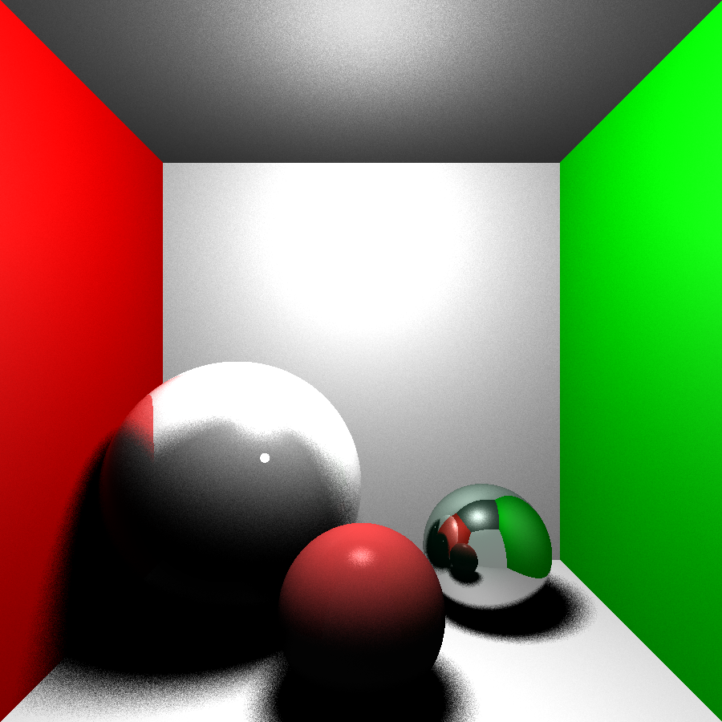

# Raytracer
A very simple raytracer in C++.
Mainly inspired by https://github.com/ssloy/tinyraytracer/wiki and the TU Wien course on Rendering by Károly Zsolnai-Fehér (Playlist: https://www.youtube.com/playlist?list=PLujxSBD-JXgnGmsn7gEyN28P1DnRZG7qi).

## Current Features
* Currently supports two primitive shapes: Spheres and Planes
* Supports some basic materials
* Basic illumination shading; crude approximation of the rendering equation
* Area light sources (currently only circles) and approximations of soft shadows
* Refraction

## Next steps
* Apply Monte Carlo integration to ~~solve~~ approximate the actual rendering equation

## Current Output
